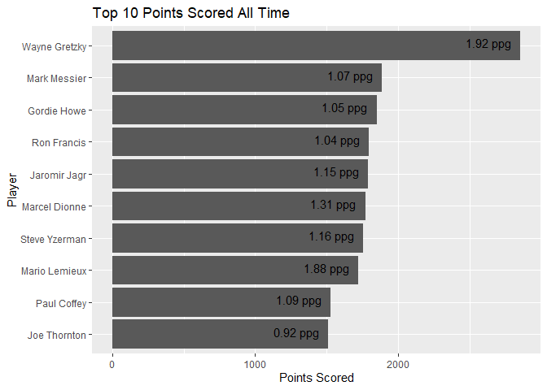

Project 1-JSON Vinette
================
Grant Swigart
6/7/2020

# Analyzing JSON data in R.

## What is JSON? Why is it useful?

JSON stands for Javascript Object Notation. It is a file type for
storing information in a understandble manner. One of the largest
benefits of this file type is that you can store arrays (some bit of
information) within one another and then

## What package should I use to read JSON data into R?

There ae three main packages that read JSON data into R.

  - rjson
  - RJSONIO
  - jsonlite

One of the major benefits of jsonlite is that it better reads JSON data
maps JSON data into R into data types that are more heavely used such as
dataframes, lists, and matrices Also, it is better in maintaining the
way that missing values ae coded. It also provides more information than
the other packages when an error occurs. JSON lite is effecient,
especially when compared to rjson.

## What the puck. Lets look at some JSON data\!

Here are the packages that we will use to analyze our data.

``` r
library(devtools)
library(tidyverse)
library(httr)
library(jsonlite)
library(knitr)
```

Thera are many tables that you can request from the API. Some that a

``` r
get_nhl<-function(table='franchise',id=''){
  #Convert the table names and franchise id's into string to prevent data issues with logical checks. 
  table<-toString(table)
  id<-toString(id)
  print(id)
  available_id<-c("8","41","45","37","10","6","43","51","39","3","16","17","49","26","25","4","5","19","7","23","20","2","1","15","22","12","21","53","28","9","14","24","13","18","52","29","30","54")
  if (id!='' & (!table %in% c('skater-records','goalie-records','season-records'))){
                stop('ERROR: Franchise Id is only used for these tables:\n
                     "skater-records","goalie-records","season-records"')
  }
  else if (id!='' & (!id %in% available_id)){
                stop(paste("ERROR: The available id's are ",paste0(available_id,collapse=" ")))
  }
  else if (id=='' & (table %in% c('skater-records','goalie-records','season-records'))){
                stop(paste('ERROR: Please submtit an id for these tables. \n
                           skater-records goalie-records season-records'))
  }
  
  base_url <- 'https://records.nhl.com/site/api'
  if(table=='franchise'){
    build_url=paste0(base_url,'/franchise')
  }
  else if(table=='team-totals'){
    build_url=paste0(base_url,'/franchise-team-totals')
  }
  else if(table=='season-records'){
    build_url=paste0(base_url,'/franchise-season-records?cayenneExp=franchiseId=',id)
  }
  else if(table=='goalie-records'){
    build_url=paste0(base_url,'/franchise-goalie-records?cayenneExp=franchiseId=',id)
  }
  else if(table=='skater-records'){
    build_url=paste0(base_url,'/franchise-skater-records?cayenneExp=franchiseId=',id)
  }
  else if(table=='player'){
    build_url=paste0(base_url,'/player')
  }
  else if(table=='draft'){
    build_url=paste0(base_url,'/draft')
  }
  else if(table=='attendance'){
    build_url=paste0(base_url,'/attendance')
  }
  else {
    stop('ERROR: The available tables are "franchise","team-totals", "season-records", "goalie-records", "skater-records", "player","draft","attendance"')
  }
  get_request<-GET(build_url)
  if (get_request$status_code==404){
    stop('Status Code 404.\n Inccorect URL. This is likely due to askinig for an unavailable table.\n
        These are tha available tables. Use the "franchise" table to find the list of franchise ids.
         "team-totals","season-records","goalie-records","skater-records","player","draft","attendance"')
  }
  request_text<-content(get_request,"text",encoding='UTF-8')
  request_list<-fromJSON(request_text,flatten=TRUE)
  request_data<-request_list$data
  return(request_data)
}
```

``` r
franchise<-get_nhl()
```

    ## [1] ""

``` r
team_totals<-get_nhl(table='team-totals')
```

    ## [1] ""

``` r
draft<-get_nhl(table='draft')
```

    ## [1] ""

``` r
attendance<-get_nhl(table='attendance')
```

    ## [1] ""

``` r
player<-get_nhl(table='player')
```

    ## [1] ""

``` r
list_responses<-lapply(franchise$mostRecentTeamId,get_nhl,table='season-records')
```

    ## [1] "8"
    ## [1] "41"
    ## [1] "45"
    ## [1] "37"
    ## [1] "10"
    ## [1] "6"
    ## [1] "43"
    ## [1] "51"
    ## [1] "39"
    ## [1] "3"
    ## [1] "16"
    ## [1] "17"
    ## [1] "49"
    ## [1] "26"
    ## [1] "25"
    ## [1] "4"
    ## [1] "5"
    ## [1] "19"
    ## [1] "7"
    ## [1] "23"
    ## [1] "20"
    ## [1] "2"
    ## [1] "1"
    ## [1] "15"
    ## [1] "22"
    ## [1] "12"
    ## [1] "21"
    ## [1] "53"
    ## [1] "28"
    ## [1] "9"
    ## [1] "14"
    ## [1] "24"
    ## [1] "13"
    ## [1] "18"
    ## [1] "52"
    ## [1] "29"
    ## [1] "30"
    ## [1] "54"

``` r
rec_season<-bind_rows(list_responses)
                     
list_responses<-lapply(franchise$mostRecentTeamId,get_nhl,table='goalie-records')
```

    ## [1] "8"
    ## [1] "41"
    ## [1] "45"
    ## [1] "37"
    ## [1] "10"
    ## [1] "6"
    ## [1] "43"
    ## [1] "51"
    ## [1] "39"
    ## [1] "3"
    ## [1] "16"
    ## [1] "17"
    ## [1] "49"
    ## [1] "26"
    ## [1] "25"
    ## [1] "4"
    ## [1] "5"
    ## [1] "19"
    ## [1] "7"
    ## [1] "23"
    ## [1] "20"
    ## [1] "2"
    ## [1] "1"
    ## [1] "15"
    ## [1] "22"
    ## [1] "12"
    ## [1] "21"
    ## [1] "53"
    ## [1] "28"
    ## [1] "9"
    ## [1] "14"
    ## [1] "24"
    ## [1] "13"
    ## [1] "18"
    ## [1] "52"
    ## [1] "29"
    ## [1] "30"
    ## [1] "54"

``` r
rec_goalie<-bind_rows(list_responses)

list_responses<-lapply(franchise$mostRecentTeamId,get_nhl,table='skater-records')
```

    ## [1] "8"
    ## [1] "41"
    ## [1] "45"
    ## [1] "37"
    ## [1] "10"
    ## [1] "6"
    ## [1] "43"
    ## [1] "51"
    ## [1] "39"
    ## [1] "3"
    ## [1] "16"
    ## [1] "17"
    ## [1] "49"
    ## [1] "26"
    ## [1] "25"
    ## [1] "4"
    ## [1] "5"
    ## [1] "19"
    ## [1] "7"
    ## [1] "23"
    ## [1] "20"
    ## [1] "2"
    ## [1] "1"
    ## [1] "15"
    ## [1] "22"
    ## [1] "12"
    ## [1] "21"
    ## [1] "53"
    ## [1] "28"
    ## [1] "9"
    ## [1] "14"
    ## [1] "24"
    ## [1] "13"
    ## [1] "18"
    ## [1] "52"
    ## [1] "29"
    ## [1] "30"
    ## [1] "54"

``` r
rec_skater<-bind_rows(list_responses)
```

Once you have the functions to query the data, you should perform a
basic exploratory data analysis. Not all things reported need to show
something interesting or meaningful (i.e. graphs that show no
relationship are fine) but you should discuss each graph (if you don’t
know hockey, that is ok - simply discuss the graphs and summaries as
best you can). A few requirements are below:

# Grahs and Visualizations

# Top 10

``` r
summary_points<-rec_skater %>%
  mutate(full_name=paste(firstName,lastName)) %>%
  group_by(playerId,full_name,activePlayer,positionCode) %>%
  summarise(seasons=sum(seasons),
            total_points=sum(points),
            games_played=sum(gamesPlayed),
            rookiePoints=sum(rookiePoints),
            penaltyMinutes=sum(penaltyMinutes),
            total_assists=sum(assists),
            total_goals=sum(goals)) %>%
  mutate(ppg=round(total_points/games_played,2),
         ppg_label=paste(as.character(ppg),'ppg')) %>%
  arrange(desc(total_points))

  

ggplot(summary_points %>% head(10),aes(x=reorder(full_name,total_points),y=total_points))+
  geom_col()+ 
  coord_flip()+
  geom_text(aes(label=ppg_label), position=position_dodge(width=0.9), hjust=1.2,vjust=.2)+
  ylab('Points Scored')+
  xlab('Player')+
  ggtitle('Top 10 Points Scored All Time')
```

<!-- -->

``` r
top_10_pos<-summary_points %>%
  group_by(positionCode) %>%
  top_n(10,wt=total_points)%>%
  select(positionCode,full_name,total_points,ppg,total_assists,total_goals) 


kable(top_10_pos%>% filter(positionCode=='L'),caption ="Top 10 Left Wing Scorers" )
```

| positionCode | full\_name       | total\_points |  ppg | total\_assists | total\_goals |
| :----------- | :--------------- | ------------: | ---: | -------------: | -----------: |
| L            | Luc Robitaille   |          1394 | 0.97 |            726 |          668 |
| L            | Johnny Bucyk     |          1369 | 0.89 |            813 |          556 |
| L            | Brendan Shanahan |          1354 | 0.89 |            698 |          656 |
| L            | Alex Ovechkin    |          1278 | 1.11 |            572 |          706 |
| L            | Dave Andreychuk  |          1206 | 0.90 |            635 |          571 |
| L            | Frank Mahovlich  |          1103 | 0.93 |            570 |          533 |
| L            | Keith Tkachuk    |          1050 | 0.89 |            519 |          531 |
| L            | Daniel Sedin     |          1041 | 0.80 |            648 |          393 |
| L            | Brian Propp      |          1004 | 0.99 |            579 |          425 |
| L            | Brian Bellows    |           942 | 0.91 |            496 |          446 |

Top 10 Left Wing Scorers

``` r
kable(top_10_pos%>% filter(positionCode=='R'),caption ="Top 10 Right Wing Scorers" )
```

| positionCode | full\_name        | total\_points |  ppg | total\_assists | total\_goals |
| :----------- | :---------------- | ------------: | ---: | -------------: | -----------: |
| R            | Gordie Howe       |          1850 | 1.05 |           1049 |          801 |
| R            | Jaromir Jagr      |          1791 | 1.15 |           1074 |          717 |
| R            | Mark Recchi       |          1448 | 0.94 |            896 |          552 |
| R            | Brett Hull        |          1391 | 1.10 |            650 |          741 |
| R            | Jari Kurri        |          1341 | 1.22 |            758 |          583 |
| R            | Mike Gartner      |          1335 | 0.93 |            627 |          708 |
| R            | Guy Lafleur       |          1291 | 1.26 |            755 |          536 |
| R            | Jarome Iginla     |          1176 | 0.88 |            610 |          566 |
| R            | Daniel Alfredsson |          1157 | 0.93 |            713 |          444 |
| R            | Mike Bossy        |          1126 | 1.50 |            553 |          573 |

Top 10 Right Wing Scorers

``` r
kable(top_10_pos%>% filter(positionCode=='C'),caption ="Top 10 Center Scorers" )
```

| positionCode | full\_name     | total\_points |  ppg | total\_assists | total\_goals |
| :----------- | :------------- | ------------: | ---: | -------------: | -----------: |
| C            | Wayne Gretzky  |          2857 | 1.92 |           1963 |          894 |
| C            | Mark Messier   |          1887 | 1.07 |           1193 |          694 |
| C            | Ron Francis    |          1798 | 1.04 |           1249 |          549 |
| C            | Marcel Dionne  |          1771 | 1.31 |           1040 |          731 |
| C            | Steve Yzerman  |          1755 | 1.16 |           1063 |          692 |
| C            | Mario Lemieux  |          1723 | 1.88 |           1033 |          690 |
| C            | Joe Thornton   |          1509 | 0.92 |           1089 |          420 |
| C            | Bryan Trottier |          1425 | 1.11 |            901 |          524 |
| C            | Phil Esposito  |          1416 | 1.35 |            773 |          643 |
| C            | Dale Hawerchuk |          1409 | 1.19 |            891 |          518 |

Top 10 Center Scorers

``` r
kable(top_10_pos%>% filter(positionCode=='D'),caption ="Top 10 Defensive Scorers" )
```

| positionCode | full\_name       | total\_points |  ppg | total\_assists | total\_goals |
| :----------- | :--------------- | ------------: | ---: | -------------: | -----------: |
| D            | Paul Coffey      |          1527 | 1.09 |           1131 |          396 |
| D            | Ray Bourque      |          1506 | 0.99 |           1111 |          395 |
| D            | Al MacInnis      |          1274 | 0.90 |            934 |          340 |
| D            | Larry Murphy     |          1217 | 0.75 |            929 |          288 |
| D            | Phil Housley     |          1164 | 0.86 |            847 |          317 |
| D            | Nicklas Lidstrom |          1142 | 0.73 |            878 |          264 |
| D            | Denis Potvin     |          1052 | 0.99 |            742 |          310 |
| D            | Brian Leetch     |          1028 | 0.85 |            781 |          247 |
| D            | Larry Robinson   |           958 | 0.69 |            750 |          208 |
| D            | Scott Stevens    |           908 | 0.56 |            712 |          196 |

Top 10 Defensive Scorers

``` r
points_draft<-summary_points %>% 
  inner_join(draft,by = "playerId") %>%
  filter(positionCode %in% c('L','R','C'),
         seasons>1) %>%
  group_by(overallPickNumber,positionCode) %>%
  summarise(ppg=mean(ppg),N=n())

ggplot(points_draft,aes(x=overallPickNumber,y=ppg))+
  facet_wrap(~positionCode)+
  geom_bar(stat='identity')+
  geom_smooth()+
  ggtitle('Average PPG by Overall Pick Number and Position',subtitle='Seasons>1, Nondefensemen') +
  xlab('Pick number')+
  ylab('Points Per Game')
```

    ## `geom_smooth()` using method = 'loess' and formula 'y ~ x'

<!-- -->

``` r
country<-summary_points %>% 
  inner_join(draft,by = "playerId") %>%
  filter(countryCode %in% c('CZE','FIN','RUS','SWE','USA','CAN'))


ggplot(country %>% filter(seasons>1,countryCode %in% c('SWE','USA','CAN')),aes(y=ppg))+
  facet_wrap(~countryCode)+
  geom_boxplot()
```

<!-- -->

``` r
country_player<-country %>%
  inner_join(player,by=c("birthDate","firstName","height", "lastName"))

ggplot(country_player %>% filter(seasons>1),aes(x=total_assists,y=total_goals,color=countryCode,shape=inHockeyHof))+
  geom_point()+
  geom_smooth(method='lm',se=FALSE,aes(group=countryCode))+
  ggtitle('Career Points and Assists by Country and Presence in Hall of Fame')+
  xlab('Career Assists')+
  ylab('Career Points')
```

<!-- -->
