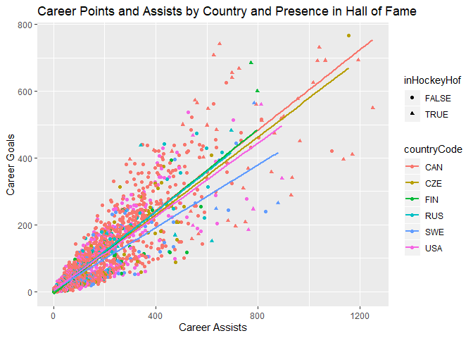

Project 1-JSON Vinette
================
Grant Swigart
6/7/2020

  - [JSON](#json)
      - [What is it, where does it get used, and why is it a good way to
        store
        data?](#what-is-it-where-does-it-get-used-and-why-is-it-a-good-way-to-store-data)
  - [Lets look at some examples of a JSON
    objects\!](#lets-look-at-some-examples-of-a-json-objects)
      - [What package should I use to read JSON data into
        R?](#what-package-should-i-use-to-read-json-data-into-r)
      - [What the puck. Lets look at some JSON
        data\!](#what-the-puck.-lets-look-at-some-json-data)
  - [What data is available and how
    much?](#what-data-is-available-and-how-much)
  - [Grahs and Visualizations](#grahs-and-visualizations)
      - [Top 10](#top-10)
      - [Summary Statistics by
        Position](#summary-statistics-by-position)
      - [Performance by Draft Pick](#performance-by-draft-pick)
      - [Number of Players by Country](#number-of-players-by-country)

# JSON

## What is it, where does it get used, and why is it a good way to store data?

JSON stands for Javascript Object Notation. It is a data format for
storing and transferring data. It was invented in the early 2000’s to
help servers communicate with browser and is very commmonly used to
transefer data through the web.

Here are some characteristics of JSON data. \* JSON data is made up of
JSON objects which contain pairs. \* Each object is wrapped by curly
braces {}. \* Each object is made of pairs of keys (strings) and values
(string, number, or another object). \* Objects can be nested within one
another and can be given IDs. \* Pairs are separated by commas.

This is similair to a nested lists in R where we have names that we can
call upon to access data. It is a great way to store data because the
structure is understandble and because it is easy for machines to parse.
Additionally JSON is made of text which allows for easy communication
between different systems. For a more in depth video please [click on
this text](https://www.youtube.com/watch?v=KdweixONFyA&vl=en)

# Lets look at some examples of a JSON objects\!

This is what a JSON object typically looks like. Typically you can
access each part of the JSON data by calling the name of the larger
group, similair to a list in R. However, for us to work with this data
in R we need to parse this data and convert it into a usable object.

``` r
library(jsonlite)
hockey_list <- list(Wayne = list(city = "Edmonton",last_name = "Gretzky"), 
          Sidney= list(city = "Pittsburgh",last_name = "Crosby"),
          Gordie= list(city = "Detroit",last_name = "Howe"))
json<-toJSON(hockey_list, pretty = TRUE, auto_unbox = TRUE)
print(json)
```

    ## {
    ##   "Wayne": {
    ##     "city": "Edmonton",
    ##     "last_name": "Gretzky"
    ##   },
    ##   "Sidney": {
    ##     "city": "Pittsburgh",
    ##     "last_name": "Crosby"
    ##   },
    ##   "Gordie": {
    ##     "city": "Detroit",
    ##     "last_name": "Howe"
    ##   }
    ## }

## What package should I use to read JSON data into R?

There are three main packages that read JSON data into R each having a
function called fromJSON (JSON object to variable) and toJSON (variable
to JSON object).

  - rjson
      - Slow.  
      - Might be no longer in devleopment. Last update was in august of
        2018.
  - RJSONIO
      - Doenst handle null values as well.
      - Mapping from R to JSON and back doesnt create identical objects.
  - jsonlite
      - Optimized for web and statistical data.

However, my preference is jsonlite because it works better with JSON
data with nested lists and better maps data from R data types to JSON
data and backwards. Jsonlite is also Jsonlite is also maintains how
missing values are coded and provide more detail an error occurs.
Jsonlite is also effecient, especially when compared to rjson. Using
fromJSON we are able to convert the json object back into the orignal
list of 3 lists.

``` r
json_data<-fromJSON(json,flatten=TRUE)
print(json_data)
```

    ## $Wayne
    ## $Wayne$city
    ## [1] "Edmonton"
    ## 
    ## $Wayne$last_name
    ## [1] "Gretzky"
    ## 
    ## 
    ## $Sidney
    ## $Sidney$city
    ## [1] "Pittsburgh"
    ## 
    ## $Sidney$last_name
    ## [1] "Crosby"
    ## 
    ## 
    ## $Gordie
    ## $Gordie$city
    ## [1] "Detroit"
    ## 
    ## $Gordie$last_name
    ## [1] "Howe"

## What the puck. Lets look at some JSON data\!

Here are the packages we need to analyze our data. The tidyverse package
provides function that allow us to process, summarize, and vizualize
data. Knitr will help us make pretty tables and httr will help us
request data from the API.

``` r
library(tidyverse)
library(knitr)
library(httr)
```

We will be looking the data available from the [NHL records
API](https://gitlab.com/dword4/nhlapi/-/blob/master/records-api.md). An
API is a application program interface and is a collection of software
that allows computers to communicate with one another. Think of how your
browser (chrome, edge, firefox) follows a url to access information from
a webpage. That webpage sends us HTML code that your computer breaks
down into an interface. In this case, we want to use R to follow a URL
to request data from the NHL records server. The text data returned from
this survey is JSON structured. Using the above package we can then
convert this data in a R dataframe, list, or tibble which we can
analyze. APIs are helpful because they give us a means of large scale
means of quickly requesting data in a reproducable manner that doesnt
require webscraping (combing through HTML of webpages). We could likely
find the information we want on a website but would have to copy and
paste or creat a long program to do this from many websites. This is
slow for us and would bombard the website servers with requests.
However, servers dont have to send us fancy HTML when they send us JSON
text. APIs are good for us and the NHL in this case.

API’s usually have several paramaters that you can specify to access
different information and filter data. The NHL records API has
information on player records, team records, attendance, and draft
information. We can also filter some of this information according to a
specific team id we want to analyze.

Lets get aquainted with using an API. An API hase a base url that is
used for all data requests and then has parameters can set. In this case
we want to look at the New Jersey Devils which has a teamid of 1. Lets
also look at skater records for this franchise. After combining the text
for the URL, we use a the GET function to submit our request to the
server. Printing this request allows us to see the status code. A status
coded of 200 means we our request was successful. If you receive a 404
this means the URL was not found.

``` r
base_url <- 'https://records.nhl.com/site/api'
id<-'1'
build_url=paste0(base_url,'/franchise-skater-records?cayenneExp=franchiseId=',id)
get_request<-GET(build_url)
print(get_request)
```

    ## Response [https://records.nhl.com/site/api/franchise-skater-records?cayenneExp=franchiseId=1]
    ##   Date: 2020-06-11 15:40
    ##   Status: 200
    ##   Content-Type: application/json
    ##   Size: 1.07 MB

Now we need to convert the request object into text. We do this by using
the content function and specifying the output and encoding. Then we use
fromJSON to convert the data into a usable object. The flatten option
turns nested data frames into a single data frame.

``` r
request_text<-content(get_request,"text",encoding='UTF-8')
request_list<-fromJSON(request_text,flatten=TRUE)
request_data<-request_list$data
print(names(request_data))
```

    ##  [1] "id"                          "activePlayer"               
    ##  [3] "assists"                     "firstName"                  
    ##  [5] "franchiseId"                 "franchiseName"              
    ##  [7] "gameTypeId"                  "gamesPlayed"                
    ##  [9] "goals"                       "lastName"                   
    ## [11] "mostAssistsGameDates"        "mostAssistsOneGame"         
    ## [13] "mostAssistsOneSeason"        "mostAssistsSeasonIds"       
    ## [15] "mostGoalsGameDates"          "mostGoalsOneGame"           
    ## [17] "mostGoalsOneSeason"          "mostGoalsSeasonIds"         
    ## [19] "mostPenaltyMinutesOneSeason" "mostPenaltyMinutesSeasonIds"
    ## [21] "mostPointsGameDates"         "mostPointsOneGame"          
    ## [23] "mostPointsOneSeason"         "mostPointsSeasonIds"        
    ## [25] "penaltyMinutes"              "playerId"                   
    ## [27] "points"                      "positionCode"               
    ## [29] "rookiePoints"                "seasons"

We now understand how APIs work, and have requested our first data. Now
lets write a larger function to request different tables from the API.
We need to include error checks to make sure the user understands
anymistakes. We also use simplier table names to make the requesting
data easier.

``` r
get_nhl<-function(table='franchise',id=''){
  #Convert the table names and franchise id's into string to prevent data issues with logical checks. 
  table<-toString(table)
  id<-toString(id)
  #This list of available ids is taken from the franchise table. 
  available_id<-c("8","41","45","37","10","6","43","51","39","3","16","17","49","26","25","4","5","19","7","23","20","2","1","15","22","12","21","53","28","9","14","24","13","18","52","29","30","54")
  
  #Basic logical checks to see if there have been any incorrect API calls or combinations of ids with the wrong table. 
  if (id!='' & (!table %in% c('skater-records','goalie-records','season-records'))){
                stop('ERROR: Franchise Id is only used for these tables:\n
                     "skater-records","goalie-records","season-records"')
  }
  else if (id!='' & (!id %in% available_id)){
                stop(paste("ERROR: The available id's are ",paste0(available_id,collapse=" ")))
  }
  #This is the base URL for the API we want to access
  base_url <- 'https://records.nhl.com/site/api'
  #We then build a different url based upon the data table specified.
  #extra processing
  if(table=='franchise'){
    build_url=paste0(base_url,'/franchise')
  }
  #extra processing
  else if(table=='team-totals'){
    build_url=paste0(base_url,'/franchise-team-totals')
  }
  else if(table=='player'){
    build_url=paste0(base_url,'/player')
  }
  else if(table=='draft'){
    build_url=paste0(base_url,'/draft')
  }
  else if(table=='attendance'){
    build_url=paste0(base_url,'/attendance')
  }
  
  # Tables that you can specify id for. 
  else if(table=='season-records'){
    if (id==''){
    build_url=paste0(base_url,'/franchise-season-records')
    }
    else {
    build_url=paste0(base_url,'/franchise-season-records?cayenneExp=franchiseId=',id)
    }
  }
  else if(table=='goalie-records'){
    if (id==''){
    build_url=paste0(base_url,'/franchise-goalie-records')
    }
    else {
    build_url=paste0(base_url,'/franchise-goalie-records?cayenneExp=franchiseId=',id)
    }  
    }
  else if(table=='skater-records'){
    if (id==''){
    build_url=paste0(base_url,'/franchise-skater-records')
    }
    else {
    build_url=paste0(base_url,'/franchise-skater-records?cayenneExp=franchiseId=',id)
    }
    }
  #If we havent found a table then we should stop and tell the user to try one that is allowed.
  else {
    stop('ERROR: The available tables are "franchise","team-totals", "season-records", "goalie-records", "skater-records", "player","draft","attendance"')
  }
  get_request<-GET(build_url)
  
  #Stop if the url request wa not to an acceptable UR?L. 
  if (get_request$status_code==404){
    stop('Status Code 404.\n Inccorect URL. This is likely due to askinig for an unavailable table.\n
        These are tha available tables. Use the "franchise" table to find the list of franchise ids.
         "team-totals","season-records","goalie-records","skater-records","player","draft","attendance"')
  }
  request_text<-content(get_request,"text",encoding='UTF-8')
  request_list<-fromJSON(request_text,flatten=TRUE)
  request_data<-as.tibble(request_list$data)
  return(request_data)
}
```

Let’s request all the data from all the tables the above function can
request. We dont have to specify a table for the franchise table because
this is the default.

``` r
franchise<-get_nhl()
```

    ## Warning: `as.tibble()` is deprecated as of tibble 2.0.0.
    ## Please use `as_tibble()` instead.
    ## The signature and semantics have changed, see `?as_tibble`.
    ## This warning is displayed once every 8 hours.
    ## Call `lifecycle::last_warnings()` to see where this warning was generated.

``` r
team_totals<-get_nhl(table='team-totals')
draft<-get_nhl(table='draft')
attendance<-get_nhl(table='attendance')
player<-get_nhl(table='player')
rec_season<-get_nhl('season-records')
rec_goalie<-get_nhl('goalie-records')
rec_skater<-get_nhl('skater-records')
```

# What data is available and how much?

``` r
str(franchise)
```

    ## tibble [38 x 6] (S3: tbl_df/tbl/data.frame)
    ##  $ id              : int [1:38] 1 2 3 4 5 6 7 8 9 10 ...
    ##  $ firstSeasonId   : int [1:38] 19171918 19171918 19171918 19191920 19171918 19241925 19241925 19251926 19251926 19261927 ...
    ##  $ lastSeasonId    : int [1:38] NA 19171918 19341935 19241925 NA NA 19371938 19411942 19301931 NA ...
    ##  $ mostRecentTeamId: int [1:38] 8 41 45 37 10 6 43 51 39 3 ...
    ##  $ teamCommonName  : chr [1:38] "Canadiens" "Wanderers" "Eagles" "Tigers" ...
    ##  $ teamPlaceName   : chr [1:38] "Montréal" "Montreal" "St. Louis" "Hamilton" ...

``` r
str(team_totals)
```

    ## tibble [104 x 30] (S3: tbl_df/tbl/data.frame)
    ##  $ id                : int [1:104] 1 2 3 4 5 6 7 8 9 10 ...
    ##  $ activeFranchise   : int [1:104] 1 1 1 1 1 1 1 1 1 1 ...
    ##  $ firstSeasonId     : int [1:104] 19821983 19821983 19721973 19721973 19261927 19261927 19671968 19671968 19671968 19671968 ...
    ##  $ franchiseId       : int [1:104] 23 23 22 22 10 10 16 16 17 17 ...
    ##  $ gameTypeId        : int [1:104] 2 3 2 3 2 3 3 2 2 3 ...
    ##  $ gamesPlayed       : int [1:104] 2937 257 3732 272 6504 515 433 4115 4115 381 ...
    ##  $ goalsAgainst      : int [1:104] 8708 634 11779 806 19863 1436 1292 12054 13893 1100 ...
    ##  $ goalsFor          : int [1:104] 8647 697 11889 869 19864 1400 1297 13527 13678 1166 ...
    ##  $ homeLosses        : int [1:104] 507 53 674 46 1132 103 93 572 679 82 ...
    ##  $ homeOvertimeLosses: int [1:104] 82 0 81 1 73 0 0 89 58 0 ...
    ##  $ homeTies          : int [1:104] 96 NA 170 NA 448 1 NA 193 205 NA ...
    ##  $ homeWins          : int [1:104] 783 74 942 84 1600 137 131 1204 1116 111 ...
    ##  $ lastSeasonId      : int [1:104] NA NA NA NA NA NA NA NA NA NA ...
    ##  $ losses            : int [1:104] 1181 120 1570 124 2693 263 212 1429 1718 175 ...
    ##  $ overtimeLosses    : int [1:104] 162 0 159 0 147 0 0 175 148 0 ...
    ##  $ penaltyMinutes    : int [1:104] 44397 4266 57422 5356 85564 8132 8937 75761 65826 6030 ...
    ##  $ pointPctg         : num [1:104] 0.533 0.0039 0.5115 0.0147 0.5125 ...
    ##  $ points            : int [1:104] 3131 2 3818 8 6667 0 4 4740 4263 12 ...
    ##  $ roadLosses        : int [1:104] 674 67 896 78 1561 160 119 857 1039 93 ...
    ##  $ roadOvertimeLosses: int [1:104] 80 0 78 0 74 0 0 86 90 1 ...
    ##  $ roadTies          : int [1:104] 123 NA 177 NA 360 7 NA 264 178 NA ...
    ##  $ roadWins          : int [1:104] 592 63 714 64 1256 107 90 850 750 95 ...
    ##  $ shootoutLosses    : int [1:104] 79 0 67 0 66 0 0 88 53 0 ...
    ##  $ shootoutWins      : int [1:104] 78 0 82 0 78 0 0 50 80 0 ...
    ##  $ shutouts          : int [1:104] 193 25 167 9 403 44 31 245 184 30 ...
    ##  $ teamId            : int [1:104] 1 1 2 2 3 3 4 4 5 5 ...
    ##  $ teamName          : chr [1:104] "New Jersey Devils" "New Jersey Devils" "New York Islanders" "New York Islanders" ...
    ##  $ ties              : int [1:104] 219 NA 347 NA 808 8 NA 457 383 NA ...
    ##  $ triCode           : chr [1:104] "NJD" "NJD" "NYI" "NYI" ...
    ##  $ wins              : int [1:104] 1375 137 1656 148 2856 244 221 2054 1866 206 ...

``` r
str(draft)
```

    ## tibble [11,588 x 25] (S3: tbl_df/tbl/data.frame)
    ##  $ id                : int [1:11588] 1 2 3 4 5 6 7 8 9 10 ...
    ##  $ amateurClubName   : chr [1:11588] "Vernon" "Oshawa" "TPS Jr." "Molot Perm" ...
    ##  $ amateurLeague     : chr [1:11588] "BCHL" "OHL" "FINLAND" "Russia" ...
    ##  $ birthDate         : chr [1:11588] "1981-07-22" "1980-04-27" "1982-04-22" "1980-11-11" ...
    ##  $ birthPlace        : chr [1:11588] "Kelowna, BC  CAN" "Mississauga, ON  CAN" "Turku, Finland" "Nizhny Tagil, Russia" ...
    ##  $ countryCode       : chr [1:11588] "CAN" "CAN" "FIN" "RUS" ...
    ##  $ csPlayerId        : int [1:11588] 15227 NA 35582 31717 3340 NA NA NA 31500 NA ...
    ##  $ draftYear         : int [1:11588] 2000 2000 2000 2000 2000 2000 2000 2000 2000 2000 ...
    ##  $ draftedByTeamId   : int [1:11588] 1 30 29 26 2 18 6 3 26 16 ...
    ##  $ firstName         : chr [1:11588] "Ken" "Brian" "Janne" "Evgeny" ...
    ##  $ height            : int [1:11588] 74 71 69 69 74 73 76 73 69 74 ...
    ##  $ lastName          : chr [1:11588] "Magowan" "Passmore" "Jokila" "Federov" ...
    ##  $ overallPickNumber : int [1:11588] 198 199 200 201 202 203 204 205 206 207 ...
    ##  $ pickInRound       : int [1:11588] 1 2 3 4 5 6 7 8 9 10 ...
    ##  $ playerId          : int [1:11588] 8468678 8468190 8468680 8468681 8468682 8468683 8468684 8468685 8468686 8468687 ...
    ##  $ playerName        : chr [1:11588] "Ken Magowan" "Brian Passmore" "Janne Jokila" "Evgeny Federov" ...
    ##  $ position          : chr [1:11588] "LW" "C" "LW" "C" ...
    ##  $ removedOutright   : chr [1:11588] "N" "N" "N" "N" ...
    ##  $ removedOutrightWhy: chr [1:11588] NA NA NA NA ...
    ##  $ roundNumber       : int [1:11588] 7 7 7 7 7 7 7 7 7 7 ...
    ##  $ shootsCatches     : chr [1:11588] "L" "L" "L" "L" ...
    ##  $ supplementalDraft : chr [1:11588] "N" "N" "N" "N" ...
    ##  $ teamPickHistory   : chr [1:11588] "NJD (from ATL)" "MIN" "CBJ" "LAK (from TBL)" ...
    ##  $ triCode           : chr [1:11588] "NJD" "MIN" "CBJ" "LAK" ...
    ##  $ weight            : int [1:11588] 207 180 169 172 174 185 206 195 161 200 ...

``` r
str(attendance)
```

    ## tibble [44 x 5] (S3: tbl_df/tbl/data.frame)
    ##  $ id               : int [1:44] 1 2 3 4 5 6 7 8 9 10 ...
    ##  $ playoffAttendance: int [1:44] 1606364 1684638 1701336 1775557 1631683 1592270 1667624 1702371 1639602 1587054 ...
    ##  $ regularAttendance: int [1:44] 21545024 21615397 21533419 21758902 12792723 21468141 21113926 20996455 21475223 21236255 ...
    ##  $ seasonId         : int [1:44] 20162017 20152016 20142015 20132014 20122013 20112012 20102011 20092010 20082009 20072008 ...
    ##  $ totalAttendance  : int [1:44] 23151388 23300035 23234755 23534459 14424406 23060411 22781550 22698826 23114825 22823309 ...

``` r
str(player)
```

    ## tibble [20,479 x 71] (S3: tbl_df/tbl/data.frame)
    ##  $ id                     : int [1:20479] 8444850 8444851 8444852 8444853 8444854 8444855 8444856 8444857 8444858 8444859 ...
    ##  $ accruedSeasons         : int [1:20479] NA NA NA NA NA NA NA NA NA NA ...
    ##  $ addNames               : chr [1:20479] "Henry" "Gordon" "Ron" "Norm" ...
    ##  $ ageSignWaiver          : int [1:20479] NA NA NA NA NA NA NA NA NA NA ...
    ##  $ ageSignelFa            : int [1:20479] NA NA NA NA NA NA NA NA NA NA ...
    ##  $ alert                  : chr [1:20479] "N" "N" "N" "N" ...
    ##  $ birthCity              : chr [1:20479] "Kenora" "Haileybury" "Calgary" "Moose Jaw" ...
    ##  $ birthCountry           : chr [1:20479] "CAN" "CAN" "CAN" "CAN" ...
    ##  $ birthDate              : chr [1:20479] "1906-04-28" "1897-07-25" "1911-07-14" "1932-11-27" ...
    ##  $ birthStateProvince     : chr [1:20479] "ON" "ON" "AB" "SK" ...
    ##  $ careerTeamId           : int [1:20479] 6 10 17 NA 8 NA 17 NA NA 10 ...
    ##  $ centralRegistryPosition: chr [1:20479] "R" "L" "C" "C" ...
    ##  $ clubElecArb            : chr [1:20479] "N" "N" "N" "N" ...
    ##  $ currentTeamId          : int [1:20479] NA NA NA NA NA NA NA NA NA NA ...
    ##  $ dateOfDeath            : chr [1:20479] NA NA "1984-10-11" NA ...
    ##  $ ddaId                  : int [1:20479] 10016 10087 10894 10962 11801 11802 11803 11804 11807 11808 ...
    ##  $ deceased               : logi [1:20479] TRUE TRUE TRUE TRUE FALSE TRUE ...
    ##  $ epPlayerId             : int [1:20479] 279321 192203 279369 179520 32755 32756 32757 21627 32808 40888 ...
    ##  $ faGroupAfterSeason     : logi [1:20479] NA NA NA NA NA NA ...
    ##  $ firstName              : chr [1:20479] "Henry" "Gordon" "Ron" "Norm" ...
    ##  $ firstSignedByTeamId    : int [1:20479] NA NA NA NA NA 3 17 17 8 NA ...
    ##  $ freeAgentGroup         : chr [1:20479] NA NA NA NA ...
    ##  $ fullName               : chr [1:20479] "Henry Harris" "Gordon Spence" "Ron Hudson" "Norm Johnson" ...
    ##  $ group5Election         : chr [1:20479] "N" "N" "N" "N" ...
    ##  $ group5SeasonsEarned    : int [1:20479] NA NA NA NA NA NA NA NA NA NA ...
    ##  $ group6Proration        : logi [1:20479] NA NA NA NA NA NA ...
    ##  $ group6SeasonsEarned    : int [1:20479] NA NA NA NA NA NA NA NA NA NA ...
    ##  $ groupsEarnedThruSeason : int [1:20479] NA NA NA NA NA NA NA NA NA NA ...
    ##  $ height                 : int [1:20479] 71 67 68 70 71 73 74 71 71 71 ...
    ##  $ hofInductionYear       : int [1:20479] NA NA NA NA NA NA NA 1969 NA NA ...
    ##  $ homeTown               : chr [1:20479] NA NA NA NA ...
    ##  $ iihfHofInductionYear   : int [1:20479] NA NA NA NA NA NA NA NA NA NA ...
    ##  $ inHockeyHof            : logi [1:20479] FALSE FALSE FALSE FALSE FALSE FALSE ...
    ##  $ inIihfHof              : int [1:20479] 0 0 0 0 0 0 0 0 0 0 ...
    ##  $ inTop100Alltime        : int [1:20479] 0 0 0 0 0 0 0 1 0 0 ...
    ##  $ inUsHockeyHof          : logi [1:20479] FALSE FALSE FALSE FALSE FALSE TRUE ...
    ##  $ isDefected             : chr [1:20479] "N" "N" "N" "N" ...
    ##  $ isDeleted              : chr [1:20479] "N" "N" "N" "N" ...
    ##  $ isJunior               : chr [1:20479] "N" "N" "N" "N" ...
    ##  $ isRetired              : logi [1:20479] NA NA NA NA NA NA ...
    ##  $ isRookie               : chr [1:20479] "N" "N" "N" "N" ...
    ##  $ isSuspended            : chr [1:20479] "N" "N" "N" "N" ...
    ##  $ lastAmateurLeagueId    : int [1:20479] NA NA NA NA NA NA NA NA NA NA ...
    ##  $ lastAmateurTeamId      : int [1:20479] NA NA NA NA NA NA NA NA NA NA ...
    ##  $ lastNHLTeamId          : int [1:20479] NA NA NA NA NA NA NA NA NA NA ...
    ##  $ lastName               : chr [1:20479] "Harris" "Spence" "Hudson" "Johnson" ...
    ##  $ loanCapException       : chr [1:20479] "N" "N" "N" "N" ...
    ##  $ longTermInjury         : chr [1:20479] "N" "N" "N" "N" ...
    ##  $ message                : chr [1:20479] NA NA NA NA ...
    ##  $ middleName             : chr [1:20479] NA "Edmund" "Justin" "Bruce" ...
    ##  $ nationality            : chr [1:20479] "CAN" "CAN" "CAN" "CAN" ...
    ##  $ nhlExperience          : int [1:20479] NA NA NA NA NA NA NA NA NA NA ...
    ##  $ onRoster               : chr [1:20479] "N" "N" "N" "N" ...
    ##  $ platformYear           : int [1:20479] NA NA NA NA NA NA NA NA NA NA ...
    ##  $ position               : chr [1:20479] "R" "L" "C" "C" ...
    ##  $ prName                 : chr [1:20479] "Henry Harris" "Gordon Spence" "Ron Hudson" "Norm Johnson" ...
    ##  $ prStat                 : int [1:20479] 7 7 7 7 7 7 7 7 7 7 ...
    ##  $ proYearReduction       : int [1:20479] NA NA NA NA NA NA NA NA NA NA ...
    ##  $ reentryWaivers         : chr [1:20479] NA NA NA NA ...
    ##  $ rosterSpecialCode      : chr [1:20479] NA NA NA NA ...
    ##  $ salaryArbitrationExp   : int [1:20479] NA NA NA NA NA NA NA NA NA NA ...
    ##  $ shootsCatches          : chr [1:20479] "L" "L" "L" "L" ...
    ##  $ sweaterNumber          : int [1:20479] 12 12 15 6 4 2 NA 12 8 22 ...
    ##  $ updateTimestamp        : chr [1:20479] "2016-06-13T17:04:31" "2016-06-14T12:28:30" "2016-06-13T17:04:31" "2016-06-13T17:04:31" ...
    ##  $ usHofInductionYear     : int [1:20479] NA NA NA NA NA 1973 NA NA NA NA ...
    ##  $ vetCapExcptn           : chr [1:20479] "N" "N" "N" "N" ...
    ##  $ waiverAmount           : int [1:20479] 0 0 0 0 0 0 0 0 0 0 ...
    ##  $ waiverDraft            : chr [1:20479] NA NA NA NA ...
    ##  $ waiverStatus           : chr [1:20479] "N" "N" "N" "N" ...
    ##  $ weight                 : int [1:20479] 185 150 148 170 164 225 168 170 170 165 ...
    ##  $ yearsPro               : int [1:20479] NA NA NA NA NA NA NA NA NA NA ...

``` r
str(rec_season)
```

    ## tibble [38 x 57] (S3: tbl_df/tbl/data.frame)
    ##  $ id                       : int [1:38] 1 2 3 4 5 6 7 8 9 10 ...
    ##  $ fewestGoals              : int [1:38] 174 170 150 173 182 147 157 155 191 147 ...
    ##  $ fewestGoalsAgainst       : int [1:38] 164 190 177 164 188 172 175 131 179 131 ...
    ##  $ fewestGoalsAgainstSeasons: chr [1:38] "2003-04 (82)" "1975-76 (80)" "1970-71 (78)" "1973-74 (78)" ...
    ##  $ fewestGoalsSeasons       : chr [1:38] "2010-11 (82)" "1972-73 (78)" "1954-55 (70)" "1967-68 (74)" ...
    ##  $ fewestLosses             : int [1:38] 19 15 17 12 21 13 16 8 21 16 ...
    ##  $ fewestLossesSeasons      : chr [1:38] "2000-01 (82)" "1978-79 (80)" "1971-72 (78)" "1979-80 (80)" ...
    ##  $ fewestPoints             : int [1:38] 36 30 47 56 38 38 51 65 24 48 ...
    ##  $ fewestPointsSeasons      : chr [1:38] "1975-76 (80)" "1972-73 (78)" "1965-66 (70)" "2006-07 (82)" ...
    ##  $ fewestTies               : int [1:38] 3 4 4 4 4 5 5 5 4 4 ...
    ##  $ fewestTiesSeasons        : chr [1:38] "1985-86 (80)" "1983-84 (80)" "2001-02 (82)" "1985-86 (80)" ...
    ##  $ fewestWins               : int [1:38] 12 12 17 17 16 14 16 25 10 20 ...
    ##  $ fewestWinsSeasons        : chr [1:38] "1975-76 (80)" "1972-73 (78)" "1952-53 (70), 1954-55 (70), 1959-60 (70)" "1969-70 (76)" ...
    ##  $ franchiseId              : int [1:38] 23 22 10 16 17 6 19 1 30 5 ...
    ##  $ franchiseName            : chr [1:38] "New Jersey Devils" "New York Islanders" "New York Rangers" "Philadelphia Flyers" ...
    ##  $ homeLossStreak           : int [1:38] 9 7 7 8 14 11 7 7 11 7 ...
    ##  $ homeLossStreakDates      : chr [1:38] "Dec 22 1985 - Feb 06 1986" "Nov 13 1999 - Dec 14 1999, Feb 27 2001 - Mar 29 2001" "Oct 20 1976 - Nov 14 1976, Mar 24 1993 - Apr 14 1993" "Dec 09 2006 - Jan 27 2007" ...
    ##  $ homePointStreak          : int [1:38] 15 23 24 26 20 27 21 34 23 18 ...
    ##  $ homePointStreakDates     : chr [1:38] "Jan 08 1997 - Mar 15 1997, Dec 14 1999 - Feb 17 2000" "Oct 17 1978 - Jan 20 1979, Jan 02 1982 - Apr 03 1982" "Oct 14 1970 - Jan 31 1971, Oct 24 1995 - Feb 15 1996" "Oct 11 1979 - Feb 03 1980" ...
    ##  $ homeWinStreak            : int [1:38] 11 14 14 20 13 20 12 13 9 13 ...
    ##  $ homeWinStreakDates       : chr [1:38] "Feb 09 2009 - Mar 20 2009" "Jan 02 1982 - Feb 25 1982" "Dec 19 1939 - Feb 25 1940" "Jan 04 1976 - Apr 03 1976" ...
    ##  $ homeWinlessStreak        : int [1:38] 14 9 10 13 16 11 12 15 17 11 ...
    ##  $ homeWinlessStreakDates   : chr [1:38] "Feb 12 1976 - Mar 30 1976, Feb 04 1979 - Mar 31 1979" "Mar 02 1999 - Apr 06 1999" "Jan 30 1944 - Mar 19 1944" "Nov 29 2006 - Feb 08 2007" ...
    ##  $ lossStreak               : int [1:38] 14 12 11 9 13 11 14 12 14 10 ...
    ##  $ lossStreakDates          : chr [1:38] "Dec 30 1975 - Jan 29 1976" "Dec 27 1972 - Jan 16 1973, Nov 22 1988 - Dec 15 1988" "Oct 30 1943 - Nov 27 1943" "Dec 08 2006 - Dec 27 2006" ...
    ##  $ mostGameGoals            : int [1:38] 9 11 12 13 12 14 14 16 11 14 ...
    ##  $ mostGameGoalsDates       : chr [1:38] "Apr 01 1979 - STL 5 @ CLR 9, Feb 12 1982 - QUE 2 @ CLR 9, Apr 06 1986 - NYI 7 @ NJD 9, Mar 10 1990 - QUE 3 @ NJ"| __truncated__ "Dec 20 1983 - PIT 3 @ NYI 11, Mar 03 1984 - NYI 11 @ TOR 6" "Nov 21 1971 - CGS 1 @ NYR 12" "Mar 22 1984 - PIT 4 @ PHI 13, Oct 18 1984 - VAN 2 @ PHI 13" ...
    ##  $ mostGoals                : int [1:38] 308 385 321 350 367 399 354 387 314 337 ...
    ##  $ mostGoalsAgainst         : int [1:38] 374 347 345 319 394 306 308 295 397 387 ...
    ##  $ mostGoalsAgainstSeasons  : chr [1:38] "1985-86 (80)" "1972-73 (78)" "1984-85 (80)" "1992-93 (84)" ...
    ##  $ mostGoalsSeasons         : chr [1:38] "1992-93 (84)" "1981-82 (80)" "1991-92 (80)" "1983-84 (80)" ...
    ##  $ mostLosses               : int [1:38] 56 60 44 48 58 47 51 40 70 52 ...
    ##  $ mostLossesSeasons        : chr [1:38] "1975-76 (80), 1983-84 (80)" "1972-73 (78)" "1984-85 (80)" "2006-07 (82)" ...
    ##  $ mostPenaltyMinutes       : int [1:38] 2494 1857 2021 2621 2674 2443 2713 1847 1716 2419 ...
    ##  $ mostPenaltyMinutesSeasons: chr [1:38] "1988-89 (80)" "1986-87 (80)" "1989-90 (80)" "1980-81 (80)" ...
    ##  $ mostPoints               : int [1:38] 111 118 113 118 119 121 113 132 113 105 ...
    ##  $ mostPointsSeasons        : chr [1:38] "2000-01 (82)" "1981-82 (80)" "2014-15 (82)" "1975-76 (80)" ...
    ##  $ mostShutouts             : int [1:38] 14 11 13 13 10 15 13 22 10 13 ...
    ##  $ mostShutoutsSeasons      : chr [1:38] "2003-04 (82)" "2018-19 (82)" "1928-29 (44)" "1974-75 (80)" ...
    ##  $ mostTies                 : int [1:38] 21 22 21 24 20 21 21 23 15 22 ...
    ##  $ mostTiesSeasons          : chr [1:38] "1977-78 (80)" "1974-75 (80)" "1950-51 (70)" "1969-70 (76)" ...
    ##  $ mostWins                 : int [1:38] 51 54 53 53 56 57 53 60 52 49 ...
    ##  $ mostWinsSeasons          : chr [1:38] "2008-09 (82)" "1981-82 (80)" "2014-15 (82)" "1984-85 (80), 1985-86 (80)" ...
    ##  $ pointStreak              : int [1:38] 16 17 19 35 18 23 14 28 11 16 ...
    ##  $ pointStreakDates         : chr [1:38] "Dec 26 1999 - Jan 28 2000" "Oct 12 2019 - Nov 23 2019" "Nov 23 1939 - Jan 13 1940" "Oct 14 1979 - Jan 06 1980" ...
    ##  $ roadLossStreak           : int [1:38] 12 15 10 8 18 14 12 10 38 11 ...
    ##  $ roadLossStreakDates      : chr [1:38] "Oct 19 1983 - Dec 01 1983" "Jan 20 1973 - Mar 31 1973" "Oct 30 1943 - Dec 23 1943, Feb 08 1961 - Mar 15 1961" "Oct 25 1972 - Nov 26 1972, Mar 03 1988 - Mar 29 1988" ...
    ##  $ roadPointStreak          : int [1:38] 10 8 11 16 8 16 10 23 14 11 ...
    ##  $ roadPointStreakDates     : chr [1:38] "Feb 27 2001 - Apr 07 2001, Jan 30 2007 - Mar 15 2007" "Feb 12 1976 - Mar 14 1976, Nov 12 1978 - Dec 09 1978, Feb 27 1981 - Mar 29 1981, Oct 07 1981 - Nov 11 1981" "Nov 05 1939 - Jan 13 1940" "Oct 20 1979 - Jan 06 1980" ...
    ##  $ roadWinStreak            : int [1:38] 10 8 9 8 8 9 10 8 6 7 ...
    ##  $ roadWinStreakDates       : chr [1:38] "Feb 27 2001 - Apr 07 2001" "Feb 27 1981 - Mar 29 1981" "Jan 16 2020 - Feb 27 2020" "Dec 22 1982 - Jan 16 1983" ...
    ##  $ roadWinlessStreak        : int [1:38] 32 20 16 19 18 14 23 12 38 18 ...
    ##  $ roadWinlessStreakDates   : chr [1:38] "Nov 12 1977 - Mar 15 1978" "Nov 03 1972 - Jan 13 1973" "Oct 09 1952 - Dec 20 1952" "Oct 23 1971 - Jan 27 1972" ...
    ##  $ winStreak                : int [1:38] 13 15 10 13 17 14 10 12 11 10 ...
    ##  $ winStreakDates           : chr [1:38] "Feb 26 2001 - Mar 23 2001" "Jan 21 1982 - Feb 20 1982" "Dec 19 1939 - Jan 13 1940, Jan 19 1973 - Feb 10 1973" "Oct 19 1985 - Nov 17 1985" ...
    ##  $ winlessStreak            : int [1:38] 7 7 5 NA 6 5 6 8 9 6 ...
    ##  $ winlessStreakDates       : chr [1:38] "Nov 30 2019 - Dec 13 2019" "Feb 25 2020 - Mar 10 2020" "Oct 12 2019 - Oct 22 2019" NA ...

``` r
str(rec_goalie)
```

    ## tibble [1,056 x 29] (S3: tbl_df/tbl/data.frame)
    ##  $ id                     : int [1:1056] 235 236 237 238 239 240 241 242 243 244 ...
    ##  $ activePlayer           : logi [1:1056] FALSE FALSE FALSE FALSE FALSE FALSE ...
    ##  $ firstName              : chr [1:1056] "Don" "Bob" "Tony" "Grant" ...
    ##  $ franchiseId            : int [1:1056] 15 28 11 25 16 18 24 18 20 13 ...
    ##  $ franchiseName          : chr [1:1056] "Dallas Stars" "Arizona Coyotes" "Chicago Blackhawks" "Edmonton Oilers" ...
    ##  $ gameTypeId             : int [1:1056] 2 2 2 2 2 2 2 2 2 2 ...
    ##  $ gamesPlayed            : int [1:1056] 315 281 873 423 489 280 711 347 516 250 ...
    ##  $ lastName               : chr [1:1056] "Beaupre" "Essensa" "Esposito" "Fuhr" ...
    ##  $ losses                 : int [1:1056] 125 114 302 117 172 96 293 133 228 140 ...
    ##  $ mostGoalsAgainstDates  : chr [1:1056] "1983-10-07" "1992-12-11, 1992-10-12" "1983-10-15, 1980-11-26" "1984-02-05, 1982-10-12" ...
    ##  $ mostGoalsAgainstOneGame: int [1:1056] 10 8 10 9 9 8 8 9 9 11 ...
    ##  $ mostSavesDates         : chr [1:1056] "1987-03-15" "1989-12-29" "1977-02-26" "1986-03-12" ...
    ##  $ mostSavesOneGame       : int [1:1056] 52 49 50 49 45 51 52 44 48 55 ...
    ##  $ mostShotsAgainstDates  : chr [1:1056] "1986-03-21" "1989-12-29" "1976-12-12" "1986-03-12" ...
    ##  $ mostShotsAgainstOneGame: int [1:1056] 55 50 53 54 50 54 54 48 52 58 ...
    ##  $ mostShutoutsOneSeason  : int [1:1056] 1 5 15 4 5 2 6 3 5 4 ...
    ##  $ mostShutoutsSeasonIds  : chr [1:1056] "19841985, 19851986, 19861987" "19911992" "19691970" "19871988" ...
    ##  $ mostWinsOneSeason      : int [1:1056] 25 33 38 40 37 36 41 33 38 19 ...
    ##  $ mostWinsSeasonIds      : chr [1:1056] "19851986" "19921993" "19691970" "19871988" ...
    ##  $ overtimeLosses         : int [1:1056] NA NA NA NA NA NA 23 NA NA NA ...
    ##  $ playerId               : int [1:1056] 8445381 8446719 8446720 8446991 8447775 8448382 8448535 8448865 8449474 8449550 ...
    ##  $ positionCode           : chr [1:1056] "G" "G" "G" "G" ...
    ##  $ rookieGamesPlayed      : int [1:1056] 44 36 63 48 66 30 14 NA 41 56 ...
    ##  $ rookieShutouts         : int [1:1056] 0 1 15 0 1 0 0 NA 1 4 ...
    ##  $ rookieWins             : int [1:1056] 18 18 38 28 37 16 2 NA 11 16 ...
    ##  $ seasons                : int [1:1056] 9 7 15 10 11 6 16 6 11 7 ...
    ##  $ shutouts               : int [1:1056] 3 14 74 9 18 5 35 10 20 8 ...
    ##  $ ties                   : int [1:1056] 45 32 148 54 58 34 63 52 62 48 ...
    ##  $ wins                   : int [1:1056] 126 116 418 226 240 137 301 151 211 58 ...

``` r
str(rec_skater)
```

    ## tibble [16,871 x 30] (S3: tbl_df/tbl/data.frame)
    ##  $ id                         : int [1:16871] 16888 16889 16890 16891 16892 16893 16894 16895 16896 16897 ...
    ##  $ activePlayer               : logi [1:16871] FALSE FALSE FALSE FALSE FALSE FALSE ...
    ##  $ assists                    : int [1:16871] 417 0 794 712 1111 33 13 852 142 0 ...
    ##  $ firstName                  : chr [1:16871] "George" "Billy" "Johnny" "Jean" ...
    ##  $ franchiseId                : int [1:16871] 5 2 6 1 6 9 9 16 23 2 ...
    ##  $ franchiseName              : chr [1:16871] "Toronto Maple Leafs" "Montreal Wanderers" "Boston Bruins" "Montréal Canadiens" ...
    ##  $ gameTypeId                 : int [1:16871] 2 2 2 2 2 2 2 2 2 2 ...
    ##  $ gamesPlayed                : int [1:16871] 1188 2 1436 1125 1518 216 216 1144 1283 4 ...
    ##  $ goals                      : int [1:16871] 296 1 545 507 395 60 24 358 36 0 ...
    ##  $ lastName                   : chr [1:16871] "Armstrong" "Bell" "Bucyk" "Beliveau" ...
    ##  $ mostAssistsGameDates       : chr [1:16871] "1956-01-07, 1957-03-16, 1957-11-24, 1961-01-15, 1961-12-02, 1962-02-25, 1964-02-23, 1965-12-18, 1969-01-31" "1917-12-19, 1917-12-29" "1971-01-01" "1955-02-19, 1956-12-01, 1962-11-24, 1965-11-20, 1967-12-28" ...
    ##  $ mostAssistsOneGame         : int [1:16871] 3 0 5 4 5 2 1 5 3 0 ...
    ##  $ mostAssistsOneSeason       : int [1:16871] 35 0 65 58 73 17 4 89 16 0 ...
    ##  $ mostAssistsSeasonIds       : chr [1:16871] "19651966" "19171918" "19701971" "19601961" ...
    ##  $ mostGoalsGameDates         : chr [1:16871] "1959-03-15, 1961-12-16" "1917-12-19" "1973-01-18, 1974-01-05" "1955-11-05, 1959-03-07, 1969-02-11" ...
    ##  $ mostGoalsOneGame           : int [1:16871] 3 1 4 4 3 2 2 3 2 0 ...
    ##  $ mostGoalsOneSeason         : int [1:16871] 23 1 51 47 31 15 6 37 6 0 ...
    ##  $ mostGoalsSeasonIds         : chr [1:16871] "19591960" "19171918" "19701971" "19551956" ...
    ##  $ mostPenaltyMinutesOneSeason: int [1:16871] 97 0 57 143 96 8 54 154 283 0 ...
    ##  $ mostPenaltyMinutesSeasonIds: chr [1:16871] "19551956" "19171918" "19571958" "19551956" ...
    ##  $ mostPointsGameDates        : chr [1:16871] "1957-03-16, 1962-02-25, 1964-12-12, 1965-03-21, 1967-11-02" "1917-12-19" "1970-12-10, 1971-02-25" "1959-03-07" ...
    ##  $ mostPointsOneGame          : int [1:16871] 4 1 6 7 6 4 2 6 3 0 ...
    ##  $ mostPointsOneSeason        : int [1:16871] 53 1 116 91 96 32 9 119 21 0 ...
    ##  $ mostPointsSeasonIds        : chr [1:16871] "19611962" "19171918" "19701971" "19581959" ...
    ##  $ penaltyMinutes             : int [1:16871] 726 0 436 1033 1087 32 223 1453 2516 0 ...
    ##  $ playerId                   : int [1:16871] 8444971 8445044 8445240 8445408 8445621 8445843 8445955 8446098 8446309 8446580 ...
    ##  $ points                     : int [1:16871] 713 1 1339 1219 1506 93 37 1210 178 0 ...
    ##  $ positionCode               : chr [1:16871] "R" "C" "L" "C" ...
    ##  $ rookiePoints               : int [1:16871] 25 1 NA 34 65 17 8 46 10 0 ...
    ##  $ seasons                    : int [1:16871] 21 1 21 20 21 6 6 15 20 1 ...

# Grahs and Visualizations

## Top 10

Now that we have lots of data lets view make some graphs to identify
differnt trends. The rec\_skater dataframe may has multiple records for
the same player. The below code allows us to see how many players have
multiple records in our dataset. Using our second line we are able to
see that there are 0 occurences of multiple records by of a player for
the same team.

``` r
print(sum(table(rec_skater$playerId)>1))
```

    ## [1] 4190

``` r
sum(table(rec_skater$playerId,rec_skater$franchiseId)>1)
```

    ## [1] 0

Lets calcualte some summary statistics for the total points, assists,
penalty minutes, games played, and other information.

``` r
summary_points<-rec_skater %>%
  mutate(full_name=paste(firstName,lastName)) %>%
  # we want to keep the player name, position code, id, and wether the player is active for further analysis.
  group_by(playerId,full_name,activePlayer,positionCode) %>%
  # Lets calculate career totals for all of the players. 
  summarise(seasons=sum(seasons),
            total_points=sum(points),
            games_played=sum(gamesPlayed),
            rookiePoints=sum(rookiePoints),
            penaltyMinutes=sum(penaltyMinutes),
            total_assists=sum(assists),
            total_goals=sum(goals)) %>%
  #Calculating the points per game and creating a label for the upcoming graph.
  mutate(ppg=round(total_points/games_played,2),
         ppg_label=paste(as.character(ppg),'ppg')) %>%
  # Sorting the data so we know the top 10 scorers. 
  arrange(desc(total_points))

print(head(summary_points))
```

    ## # A tibble: 6 x 13
    ## # Groups:   playerId, full_name, activePlayer [6]
    ##   playerId full_name activePlayer positionCode seasons total_points
    ##      <int> <chr>     <lgl>        <chr>          <int>        <int>
    ## 1  8447400 Wayne Gr~ FALSE        C                 21         2857
    ## 2  8448208 Jaromir ~ FALSE        R                 27         1921
    ## 3  8449573 Mark Mes~ FALSE        C                 25         1887
    ## 4  8448000 Gordie H~ FALSE        R                 26         1850
    ## 5  8446951 Ron Fran~ FALSE        C                 25         1798
    ## 6  8446430 Marcel D~ FALSE        C                 19         1771
    ## # ... with 7 more variables: games_played <int>, rookiePoints <int>,
    ## #   penaltyMinutes <int>, total_assists <int>, total_goals <int>,
    ## #   ppg <dbl>, ppg_label <chr>

Lets look at the players who have the most points scored(goals+assists)
of all times. Also lets look at effeciency by adding text that has the
points per game for each player. Its amazing to me how much more
effecient and productive wayne gretsky was. Even amongst the best
players in NHL history he clearly stands out from the pack.

``` r
# We filter the data so we only see the top 10 scoreres
# We also reorder the data so that the grph is in descending order of total points
ggplot(summary_points %>% head(10),aes(x=reorder(full_name,total_points),y=total_points))+
  #Creating bar graph
  geom_col()+ 
  #Flipping columns to rows
  coord_flip()+
  #Adding text containing points per game
  geom_text(aes(label=ppg_label), position=position_dodge(width=0.9), hjust=1.2,vjust=.2)+
  #Adding title and labelel
  ylab('Points Scored')+
  xlab('Player')+
  ggtitle('Top 10 Points Scored All Time')
```

<!-- -->

## Summary Statistics by Position

Next lets break some of the information accross position. Lets group out
data by position code and then take the top 10 highest scorers of each
position.

``` r
top_10_pos<-summary_points %>%
  group_by(positionCode) %>%
  top_n(10,wt=total_points)%>%
  select(positionCode,full_name,total_points,ppg,total_assists,total_goals) %>%
  mutate(goal_assist_rat=total_goals/total_assists)

kable(top_10_pos %>% filter(positionCode=='L') %>% ungroup() %>% select(-positionCode),caption ="Top 10 Left Wing Scorers" )
```

| full\_name       | total\_points |  ppg | total\_assists | total\_goals | goal\_assist\_rat |
| :--------------- | ------------: | ---: | -------------: | -----------: | ----------------: |
| Luc Robitaille   |          1394 | 0.97 |            726 |          668 |         0.9201102 |
| Johnny Bucyk     |          1369 | 0.89 |            813 |          556 |         0.6838868 |
| Brendan Shanahan |          1354 | 0.89 |            698 |          656 |         0.9398281 |
| Dave Andreychuk  |          1338 | 0.82 |            698 |          640 |         0.9169054 |
| Alex Ovechkin    |          1278 | 1.11 |            572 |          706 |         1.2342657 |
| Bobby Hull       |          1170 | 1.10 |            560 |          610 |         1.0892857 |
| Michel Goulet    |          1153 | 1.06 |            605 |          548 |         0.9057851 |
| Frank Mahovlich  |          1103 | 0.93 |            570 |          533 |         0.9350877 |
| Keith Tkachuk    |          1065 | 0.89 |            527 |          538 |         1.0208729 |
| Ray Whitney      |          1064 | 0.80 |            679 |          385 |         0.5670103 |

Top 10 Left Wing Scorers

``` r
kable(top_10_pos %>% filter(positionCode=='R') %>% ungroup() %>% select(-positionCode),caption ="Top 10 Right Wing Scorers" )
```

| full\_name      | total\_points |  ppg | total\_assists | total\_goals | goal\_assist\_rat |
| :-------------- | ------------: | ---: | -------------: | -----------: | ----------------: |
| Jaromir Jagr    |          1921 | 1.11 |           1155 |          766 |         0.6632035 |
| Gordie Howe     |          1850 | 1.05 |           1049 |          801 |         0.7635844 |
| Mark Recchi     |          1533 | 0.93 |            956 |          577 |         0.6035565 |
| Teemu Selanne   |          1457 | 1.00 |            773 |          684 |         0.8848642 |
| Jari Kurri      |          1398 | 1.12 |            797 |          601 |         0.7540778 |
| Brett Hull      |          1391 | 1.10 |            650 |          741 |         1.1400000 |
| Guy Lafleur     |          1353 | 1.20 |            793 |          560 |         0.7061791 |
| Mike Gartner    |          1335 | 0.93 |            627 |          708 |         1.1291866 |
| Jarome Iginla   |          1300 | 0.84 |            675 |          625 |         0.9259259 |
| Dino Ciccarelli |          1200 | 0.97 |            592 |          608 |         1.0270270 |

Top 10 Right Wing Scorers

``` r
kable(top_10_pos %>% filter(positionCode=='C') %>% ungroup() %>% select(-positionCode),caption ="Top 10 Center Scorers" )
```

| full\_name    | total\_points |  ppg | total\_assists | total\_goals | goal\_assist\_rat |
| :------------ | ------------: | ---: | -------------: | -----------: | ----------------: |
| Wayne Gretzky |          2857 | 1.92 |           1963 |          894 |         0.4554254 |
| Mark Messier  |          1887 | 1.07 |           1193 |          694 |         0.5817267 |
| Ron Francis   |          1798 | 1.04 |           1249 |          549 |         0.4395516 |
| Marcel Dionne |          1771 | 1.31 |           1040 |          731 |         0.7028846 |
| Steve Yzerman |          1755 | 1.16 |           1063 |          692 |         0.6509878 |
| Mario Lemieux |          1723 | 1.88 |           1033 |          690 |         0.6679574 |
| Joe Sakic     |          1641 | 1.19 |           1016 |          625 |         0.6151575 |
| Phil Esposito |          1590 | 1.24 |            873 |          717 |         0.8213058 |
| Joe Thornton  |          1509 | 0.92 |           1089 |          420 |         0.3856749 |
| Stan Mikita   |          1467 | 1.05 |            926 |          541 |         0.5842333 |

Top 10 Center Scorers

``` r
kable(top_10_pos %>% filter(positionCode=='D') %>% ungroup() %>% select(-positionCode),caption ="Top 10 Defensive Scorers")
```

| full\_name          |   total\_points |     ppg |   total\_assists |   total\_goals |                                                                                                                                                                                                                                                                                   goal\_assist\_rat |
| :------------------ | --------------: | ------: | ---------------: | -------------: | --------------------------------------------------------------------------------------------------------------------------------------------------------------------------------------------------------------------------------------------------------------------------------------------------: |
| Ray Bourque         |            1579 |    0.98 |             1169 |            410 |                                                                                                                                                                                                                                                                                           0.3507271 |
| Paul Coffey         |            1531 |    1.09 |             1135 |            396 |                                                                                                                                                                                                                                                                                           0.3488987 |
| Al MacInnis         |            1274 |    0.90 |              934 |            340 |                                                                                                                                                                                                                                                                                           0.3640257 |
| Phil Housley        |            1232 |    0.82 |              894 |            338 |                                                                                                                                                                                                                                                                                           0.3780761 |
| Larry Murphy        |            1217 |    0.75 |              929 |            288 |                                                                                                                                                                                                                                                                                           0.3100108 |
| Nicklas Lidstrom    |            1142 |    0.73 |              878 |            264 |                                                                                                                                                                                                                                                                                           0.3006834 |
| Denis Potvin        |            1052 |    0.99 |              742 |            310 |                                                                                                                                                                                                                                                                                           0.4177898 |
| Brian Leetch        |            1028 |    0.85 |              781 |            247 |                                                                                                                                                                                                                                                                                           0.3162612 |
| Larry Robinson      |             958 |    0.69 |              750 |            208 |                                                                                                                                                                                                                                                                                           0.2773333 |
| Chris Chelios       |             948 |    0.57 |              763 |            185 |                                                                                                                                                                                                                                                                                           0.2424640 |
| Wayne is still look | ing more incred | ible fr | om this data. Wh | ile his number | of goals is greater than his nearest scorer by %28 his number of assists is %64 greater\! He must have been great at setting up his teammates and an excellent passer. Also it looks like there are higher goals/points ratios for left and right forward positions compared to the center positon. |

Top 10 Defensive Scorers

## Performance by Draft Pick

Next lets see what the average ppg for each draft pick. We merged the
draft dataframe with our summary statistcs and then calculate our
average ppf. We expect to see less ppg for defensemen so we should
remove them from our analysis.

``` r
points_draft<-summary_points %>% 
  inner_join(draft,by = "playerId") %>%
  filter(positionCode %in% c('L','R','C'),
         seasons>1) %>%
  group_by(overallPickNumber,positionCode) %>%
  summarise(ppg=mean(ppg),N=n())
```

We create a bar chart to view the ppg for each pick and each player. To
dentify the trend lines lets add the geom\_smooth. Its interesting to
see the same trend by forward position. It seems that drafting one
position over another might not be beneficial. However, another measure
like win shares might better analyze this decision. Also It seems that
picks past 60 all begin to have similair value in terms of ppg .

``` r
ggplot(points_draft,aes(x=overallPickNumber,y=ppg))+
  facet_wrap(~positionCode)+
  geom_bar(stat='identity')+
  geom_smooth(method='loess')+
  ggtitle('Average PPG by Overall Pick Number and Position',subtitle='Seasons>1, Nondefensemen') +
  xlab('Pick number')+
  ylab('Points Per Game')
```

<!-- -->

How many people are drafted from each differnt country? We do this by
using the table command on the county code variable to count the number
of players. Then we use the kable funciton to make it more pretty. There
are over twice as many candaians playing in the NHL compared to
americans\! It seems like some rebranding is necessary given 7 of the 31
candian teams and the majority of players are from another country.

## Number of Players by Country

``` r
table(draft$countryCode) %>%
  sort() %>%
  tail(10) %>% 
  kable()
```

| Var1 | Freq |
| :--- | ---: |
| LVA  |   36 |
| CHE  |   67 |
| DEU  |   70 |
| SVK  |  166 |
| CZE  |  452 |
| FIN  |  456 |
| RUS  |  646 |
| SWE  |  721 |
| USA  | 2479 |
| CAN  | 6239 |

We can also see how the number of players has changed from year to year
by graphing the number of usa born and foreign born players over time. I
am a NBA fan so I wondered if similarly we would see an increase of
foreign born plavers over time. However, it seems clear that foreign
born players are drafted more frequentyly. Additionally, the number of
foreign born players looks to be more correlated with the total number
of draft picks than is the number of us born players. Also when there
was an increase in draft pick it looks like franchises were more likely
to seek out foreign players than domestic players.

``` r
draft_group<-draft %>%
  mutate(foreign=ifelse(countryCode=="USA",'usa','foreign'))%>%
  group_by(foreign,draftYear) %>%
  summarise(N=n()) %>%
  filter(!is.na(foreign)) 

draft_total<-draft %>%
              group_by(draftYear) %>%
              summarise(N=n(),foreign="total")

draft_country<-bind_rows(draft_group,draft_total)


ggplot(draft_country,aes(x=draftYear,color=foreign))+
  geom_line(aes(y=N,group=foreign))+
  ggtitle('Number of USA Players Drafted by Year')+
  xlab('Draft Year')+
  xlab('Nunmber of Players Drafted')
```

<!-- -->

Are players from any one nation better? We then compae the distribution
of pgg using boxplots. The three distibutions look largely similair.
There appear to be more canadian players with a high points per game
compared to sweden or the united states. However, it should be noted
that there are many more canadian players than sweden or u.s. players.

``` r
country<-summary_points %>% 
  inner_join(draft,by = "playerId") %>%
  filter(countryCode %in% c('CZE','FIN','RUS','SWE','USA','CAN'))

ggplot(country %>% filter(seasons>1,countryCode %in% c('SWE','USA','CAN')),aes(y=ppg))+
  facet_wrap(~countryCode)+
  geom_boxplot()
```

<!-- -->

Lastly, lets look at the number of goals and assists by country of
origin. Also, we can include the presence in the hockey hall of fame by
using a third dimension that shows through the shape of the point.
Unsurprisingly, it looks like the more hall of famers are from canada.
Also, one czech player looks to have some amazing career totals but isnt
in the hall of fame. I looked him up and Jaromir Jagr is not yet
elligble for the hall of fame but will be inducted. Most of the
countries have the same trendline for career assists and goals. Sweden
looks like on average they score more assists than goals. However, it
seems likely that this could be affected by a few outliers.

``` r
country_player<-country%>%
  inner_join(player,by=c("birthDate","firstName","height", "lastName"))

ggplot(country_player %>% filter(seasons>1),aes(x=total_assists,y=total_goals,color=countryCode,shape=inHockeyHof))+
  geom_point()+
  geom_smooth(method='lm',se=FALSE,aes(group=countryCode))+
  ggtitle('Career Points and Assists by Country and Presence in Hall of Fame')+
  xlab('Career Assists')+
  ylab('Career Goals')
```

<!-- -->

``` r
country_player %>% filter(countryCode=='CZE') %>% arrange(desc(total_points)) %>% select(total_points,inHockeyHof,activePlayer,draftYear)
```

    ## Adding missing grouping variables: `playerId`, `full_name`

    ## # A tibble: 183 x 6
    ## # Groups:   playerId, full_name, activePlayer [181]
    ##    playerId full_name     total_points inHockeyHof activePlayer draftYear
    ##       <int> <chr>                <int> <lgl>       <lgl>            <int>
    ##  1  8448208 Jaromir Jagr          1921 FALSE       FALSE             1990
    ##  2  8460542 Patrik Elias          1025 FALSE       FALSE             1994
    ##  3  8460577 Milan Hejduk           805 FALSE       FALSE             1994
    ##  4  8459492 Vinny Prospal          765 FALSE       FALSE             1993
    ##  5  8447958 Bobby Holik            747 FALSE       FALSE             1989
    ##  6  8460465 Petr Sykora            721 FALSE       FALSE             1995
    ##  7  8449807 Petr Nedved            717 FALSE       FALSE             1990
    ##  8  8458955 Martin Straka          717 FALSE       FALSE             1992
    ##  9  8456966 Robert Lang            703 FALSE       FALSE             1990
    ## 10  8474161 Jakub Voracek          695 FALSE       TRUE              2007
    ## # ... with 173 more rows
